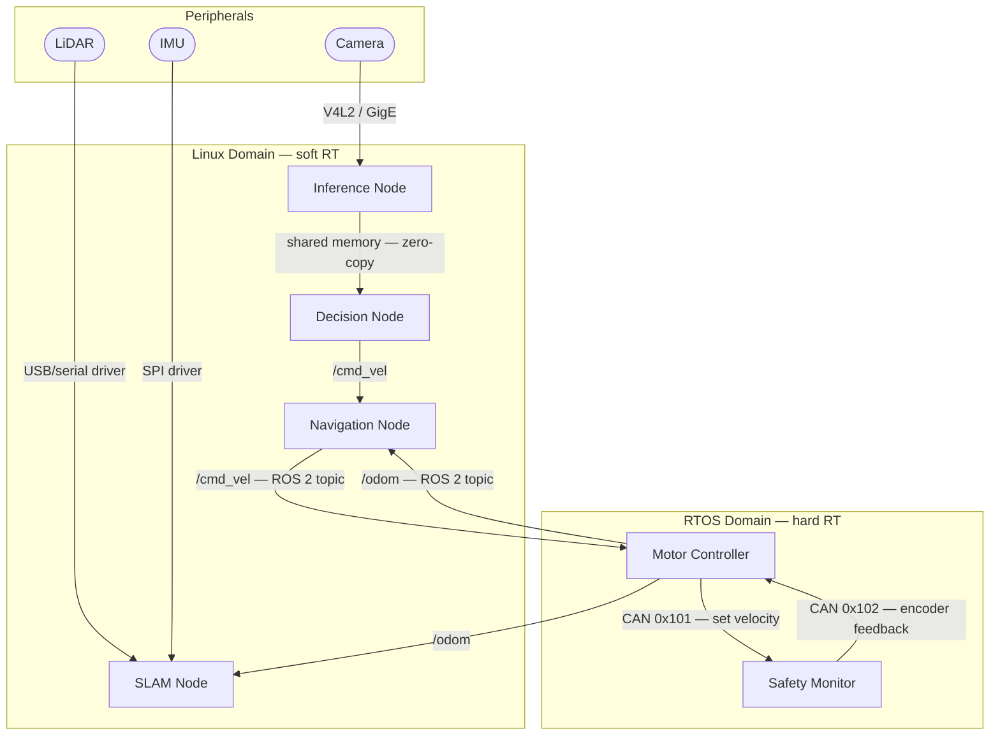

# Bus / IPC Boundary — <SystemName>

> Boundary Type: Bus / IPC | Audience: embedded architects, software leads, integration engineers
> ADR: <link or n/a> | Last updated: <date> | Status: DRAFT / APPROVED

## Purpose
<!-- Définit les canaux de communication internes entre composants logiciels et matériels.
     Répond à : "qui publie quoi, qui consomme quoi, sur quel medium, avec quelles garanties ?" -->

## Communication Media
| Medium | Type | Scope | Notes |
|--------|------|-------|-------|
| DDS / RTPS | pub/sub | inter-process, multi-node | ROS 2 default |
| ROS 2 topic | pub/sub | inter-node | typed, QoS configurable |
| ROS 2 service | request/reply | inter-node | synchronous |
| ROS 2 action | goal/feedback/result | inter-node | long-running tasks |
| POSIX shared memory | shared buffer | intra-host | zero-copy, requires mutex |
| Unix socket / pipe | stream | intra-host | |
| CAN bus | broadcast frame | MCU ↔ SBC | deterministic, low bandwidth |
| UART / SPI / I²C | point-to-point | MCU ↔ peripheral | |
| Custom IPC / mmap | <describe> | <scope> | |

Keep only what is actually used.

---

## Channel Register

> One row per logical channel. A channel = one topic / service / action / bus signal / IPC endpoint.

| Channel | Medium | Direction | Producer | Consumer | Message Type | QoS / Timing | Notes |
|---------|--------|-----------|----------|----------|--------------|--------------|-------|
| `/cmd_vel` | ROS 2 topic | → | Navigation | Base Controller | `geometry_msgs/Twist` | Best effort, 50 Hz | |
| `/odom` | ROS 2 topic | → | Base Controller | Navigation, SLAM | `nav_msgs/Odometry` | Reliable, 100 Hz | |
| `/set_velocity` (CAN 0x101) | CAN | → | SBC | Motor MCU | `int16 left, right` | 1 ms cycle | safety-critical |
| `/encoder_feedback` (CAN 0x102) | CAN | ← | Motor MCU | SBC | `int32 ticks_l, ticks_r` | 1 ms cycle | |
| `perception/inference_result` | shared memory | → | Inference Node | Decision Node | `InferenceResult` struct | < 5 ms latency target | zero-copy |
| `<channel>` | | | | | | | |

---

## Execution Domain Boundary

> Définit les frontières d'exécution traversées par les canaux ci-dessus.

| Domain | Type | OS / Runtime | Examples |
|--------|------|--------------|---------|
| RTOS domain | hard real-time | FreeRTOS / Zephyr / bare-metal | Motor control, safety loop |
| Linux domain | soft real-time | Linux + PREEMPT_RT | ROS 2 nodes, inference |
| Hypervisor partition | isolated VM | <hypervisor> | <if applicable> |
| Co-processor | offload | DSP / FPGA / NPU | <if applicable> |

### Cross-Domain Channels
| Channel | From Domain | To Domain | Bridge Mechanism | Latency Budget | Safety Class |
|---------|-------------|-----------|-----------------|----------------|--------------|
| `/set_velocity` | Linux | RTOS | CAN driver | < 2 ms | safety-critical |
| `/watchdog_heartbeat` | RTOS | Linux | shared register / GPIO | < 1 ms | safety-critical |
| `<channel>` | | | | | |

---

## QoS & Timing Contracts

> À remplir pour tout canal dont la violation de timing a un impact fonctionnel ou sécurité.

| Channel | Min Rate | Max Rate | Max Latency | On Violation |
|---------|----------|----------|-------------|--------------|
| `/cmd_vel` | 10 Hz | 100 Hz | 20 ms | stop motors |
| `/set_velocity` CAN | 1 kHz | 1 kHz | 2 ms | MCU safe-state |
| `<channel>` | | | | |

---

## Diagram

---

## Ownership & Interface Contracts

| Channel | Owner | Contract File | Breaking Change Policy |
|---------|-------|---------------|----------------------|
| `/cmd_vel` | Navigation team | `interfaces/cmd_vel.md` | ADR required |
| CAN 0x101 | Firmware team | `interfaces/can_protocol.md` | ADR required |
| `<channel>` | | | |

---

## Failure & Safety Contracts

| Channel | Failure Mode | Detection | Response | Notes |
|---------|-------------|-----------|----------|-------|
| `/cmd_vel` timeout | producer crash / overload | watchdog timer | motors → safe-state | |
| CAN bus-off | wire fault / EMI | CAN controller flag | MCU → fallback mode | |
| shared memory stale | producer stalled | timestamp check | consumer → last-known-good | |
| `<channel>` | | | | |

---

## Known Constraints & Caveats
<!-- Limitations connues sur les canaux documentés ici. -->
- <e.g. CAN bandwidth saturé au-delà de 8 nœuds à 1 kHz>
- <e.g. DDS discovery multicast désactivé en prod → static peer list required>
- <e.g. shared memory non protégé contre les accès concurrents si le consumer crash>

## Open Questions
- [ ] <question> → route to $architect / $adr / firmware team

---
Maintainer/Author: <MAINTAINER_AUTHOR>
Version: <SEM_VERSION (start at 0.1.0)>
ADR: <link or n/a>
Status: DRAFT / APPROVED
Last modified: <DATE>
---
