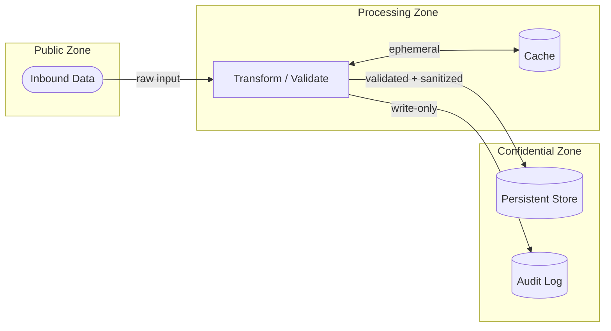

# Data Boundary — <SystemName>

> Boundary Type: Data | Audience: architects, data engineers, legal/compliance

## Purpose
<!-- Définit où les données vivent, qui y accède, et ce qui ne peut pas sortir.
     Répond à : "quelles données traversent quelle frontière, et comment ?" -->

## Data Zones
| Zone | Sensitivity | Storage | Encryption at Rest | Notes |
|------|-------------|---------|-------------------|-------|
| <name> | public / internal / confidential / secret | <location> | yes / no | |

## Data Flows Across Boundaries
| From | To | Data Type | Transformation | Allowed | Notes |
|------|----|-----------|----------------|---------|-------|
| <zone> | <zone> | <type> | none / masked / aggregated / ... | yes / no | |

## Diagram

## Retention & Deletion Rules
<!-- Durée de rétention par zone, politique de suppression, droit à l'oubli si applicable. -->

## Compliance Constraints
<!-- RGPD, SOC2, HIPAA, export control — ce qui contraint les flux. -->

## Open Questions
- [ ] <question> → route to $architect / $adr / legal

---
Maintainer/Author: <MAINTAINER_AUTHOR>
Version: <SEM_VERSION (start at 0.1.0)>
ADR: <link or n/a>
Status: DRAFT / APPROVED
Last modified: <DATE>
---
