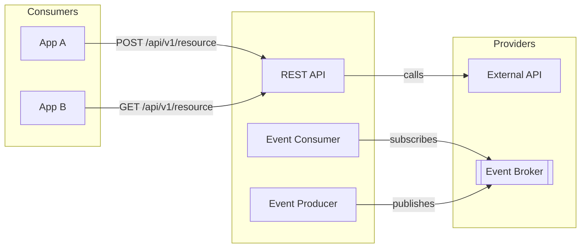

# Integration Boundary — <SystemName>

> Boundary Type: Integration | Audience: developers, architects, consumers

## Purpose
<!-- Définit les contrats exposés vers l'extérieur et les dépendances consommées.
     Répond à : "qu'est-ce que ce système promet, et à quoi dépend-il ?" -->

## Exposed Contracts (Producer)
| Endpoint / Topic | Protocol | Auth | Stability | Consumer |
|-----------------|----------|------|-----------|---------|
| `POST /api/v1/<resource>` | REST | JWT | stable / beta / internal | <consumer> |
| `<topic.name>` | AMQP / Kafka | mTLS | ... | |

## Consumed Contracts (Consumer)
| Endpoint / Topic | Provider | Protocol | Failure Mode | Notes |
|-----------------|----------|----------|--------------|-------|
| `<url or topic>` | <system> | REST / gRPC / ... | retry / circuit-breaker / fail-fast | |

## Diagram

## Versioning Policy
<!-- Comment les breaking changes sont communiqués et gérés (versionning URI, deprecation notice, ...). -->

## Compatibility Guarantees
| Contract | Backward Compatible | Forward Compatible | Notes |
|----------|--------------------|--------------------|-------|
| `POST /api/v1/<resource>` | yes / no | yes / no | |

## Deprecation Register
| Contract | Deprecated Since | Removal Target | Migration Path |
|----------|-----------------|----------------|----------------|
| `<endpoint>` | <date> | <date or version> | <link or description> |

## Open Questions
- [ ] <question> → route to $architect / $adr / consumer teams

---
Maintainer/Author: <MAINTAINER_AUTHOR>
Version: 0.1.0
Last modified: <DATE>
---
