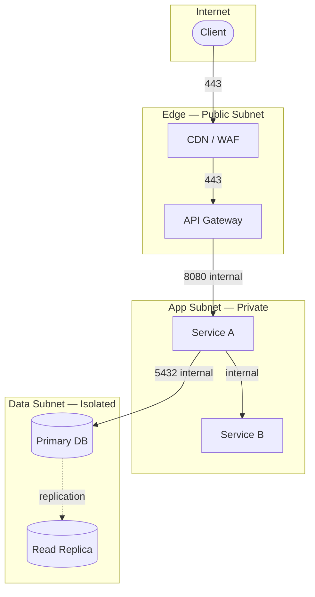

# Network Boundary — <SystemName>

> Boundary Type: Network | Audience: ops, architects, infra

## Purpose
<!-- Définit les segments réseau, les règles de routage, et les points d'exposition.
     Répond à : "qu'est-ce qui est joignable depuis où ?" -->

## Network Segments
| Segment | Type | CIDR / Location | Public | Notes |
|---------|------|-----------------|--------|-------|
| <name> | VPC / subnet / DMZ / edge / ... | <range or region> | yes / no | |

## Ingress / Egress Rules
| From | To | Port / Protocol | Direction | Justification |
|------|----|-----------------|-----------|---------------|
| <segment> | <segment> | 443/HTTPS | ingress | |

## Diagram

## Firewall / Security Group Rules Summary
<!-- Résumé des règles non évidentes depuis le diagramme. -->

## Egress Constraints
<!-- Ce qui ne peut PAS sortir, ou qui doit passer par un proxy. -->

## Open Questions
- [ ] <question> → route to $architect / infra

---
Maintainer/Author: <MAINTAINER_AUTHOR>
Version: <SEM_VERSION (start at 0.1.0)>
ADR: <link or n/a>
Status: DRAFT / APPROVED
Last modified: <DATE>
---
