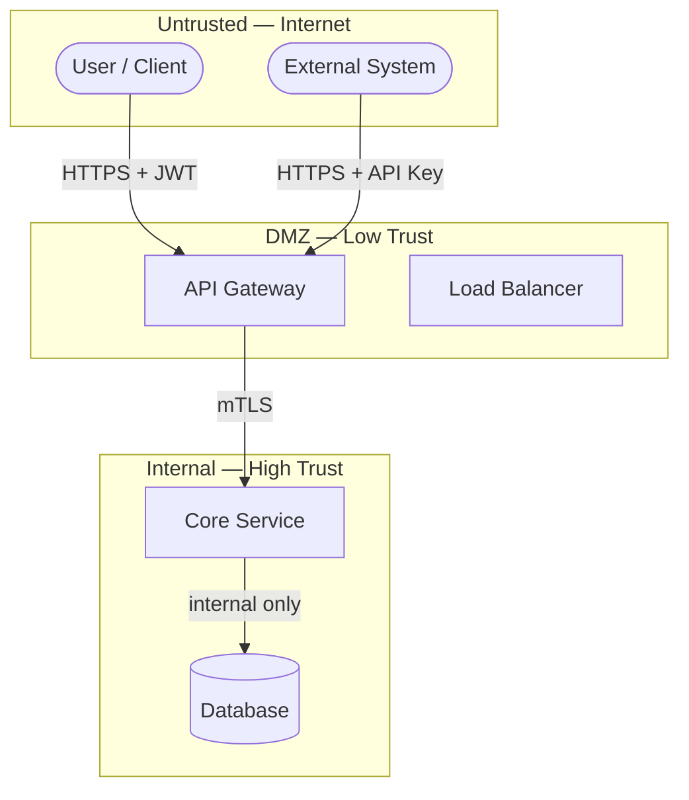

# Trust Boundary — <SystemName>

> Boundary Type: Trust | Audience: architects, security, ops

## Purpose
<!-- Définit les zones de confiance et les points de franchissement.
     Répond à : "qui fait confiance à qui, et sous quelle condition ?" -->

## Trust Zones
| Zone | Trust Level | Inhabitants |
|------|-------------|-------------|
| <name> | high / medium / low / untrusted | <components or actors> |

## Crossing Rules
| From Zone | To Zone | Mechanism | Auth Required | Notes |
|-----------|---------|-----------|---------------|-------|
| <zone> | <zone> | API Gateway / mTLS / JWT / ... | yes / no | |

## Diagram

## Threat Surface Notes
<!-- Points d'entrée exposés, vecteurs d'attaque connus, mitigations en place. -->

## Auth & Identity Contracts
<!-- Quels tokens/certificats sont attendus à chaque franchissement. -->

## Open Questions
- [ ] <question> → route to $architect / $adr

---
Maintainer/Author: <MAINTAINER_AUTHOR>
Version: <SEM_VERSION (start at 0.1.0)>
ADR: <link or n/a>
Status: DRAFT / APPROVED
Last modified: <DATE>
---
