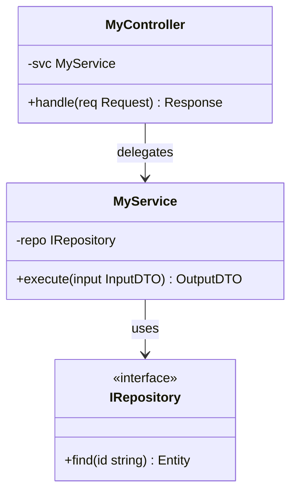

# Code — <ComponentName>

> C4 Level 4 | Audience: developers implementing or reviewing

## Scope
<!-- Which component from Level 3. Optionnel — utiliser seulement si
     la structure interne n'est pas évidente à la lecture du code. -->

## Class / Module Structure
| Class / Module | Role | Source |
|----------------|------|--------|
| <name> | <role> | `src/path/file.ts` |

## Diagram

## Critical Invariants
<!-- Préconditions, postconditions, invariants qui ne doivent jamais être violés. -->
- <invariant 1>
- <invariant 2>

## Known Shortcuts / Tech Debt
- [ ] <shortcut> → tracked in <issue>

## When This Doc Should Be Updated
<!-- e.g. "any change to MyService public API requires updating this file" -->

---
Maintainer/Author: <MAINTAINER_AUTHOR>
Version: <SEM_VERSION (start at 0.1.0)>
ADR: <link or n/a>
Status: DRAFT / APPROVED
Last modified: <DATE>
---
