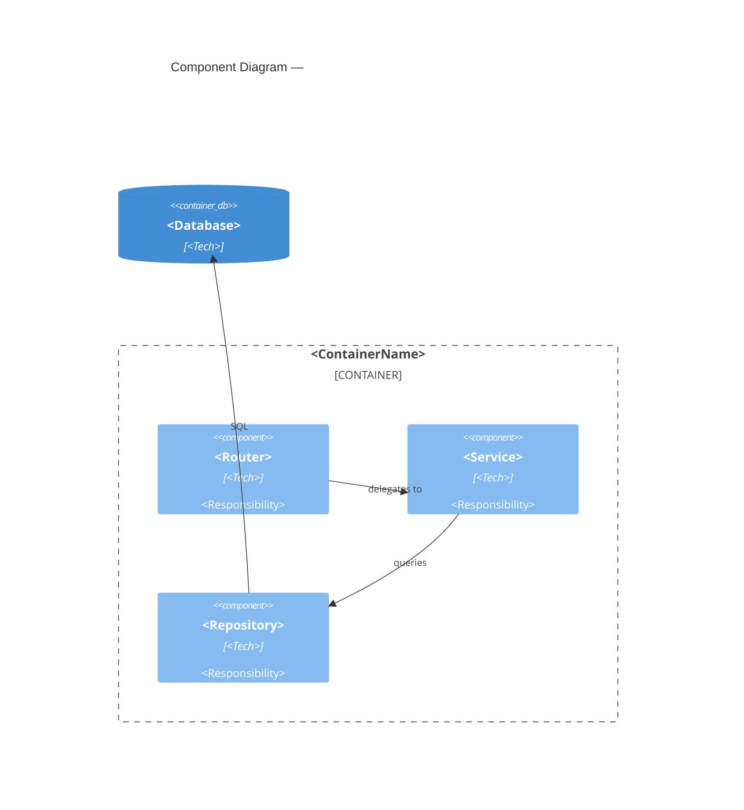

# Component Diagram — <ContainerName>

> C4 Level 3 | Audience: developers, tech leads

## Scope
<!-- Which container from Level 2 is being decomposed. -->

## Components
| Component | Type | Responsibility | Entry Point |
|-----------|------|----------------|-------------|
| <name> | Service / Repository / Handler / ... | <responsibility> | `src/path/to/file` |

## Inter-Component Communication
| From | To | Mechanism | Notes |
|------|----|-----------|-------|
| <component> | <component> | direct call / event / interface | |

## Diagram



## Key Interfaces / Contracts
```typescript
// pseudocode suffisant pour décrire le contrat public
interface IMyService {
  execute(input: InputDTO): Promise<OutputDTO>
}
```

## Error Handling Policy
<!-- How are failures surfaced? Exceptions, result types, events? -->

## Testability Notes
<!-- Which components are unit-testable in isolation? What needs mocking? -->

## Open Questions
- [ ] <question> → route to $coder / $architect

---
Maintainer/Author: <MAINTAINER_AUTHOR>
Version: <SEM_VERSION (start at 0.1.0)>
ADR: <link or n/a>
Status: DRAFT / APPROVED
Last modified: <DATE>
---
