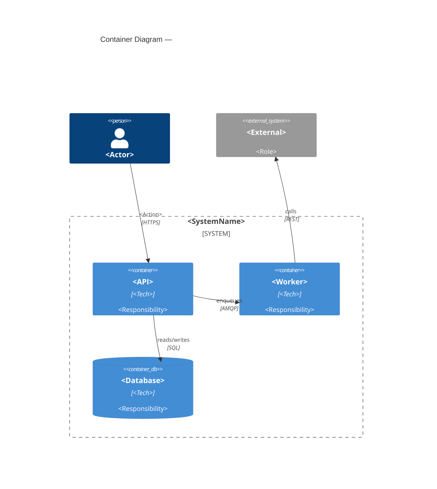

# Container Diagram — <SystemName>

> C4 Level 2 | Audience: architects, senior devs, ops

## Scope
<!-- Which system from Level 1 is being decomposed. -->

## Containers
| Container | Technology | Responsibility |
|-----------|------------|----------------|
| <name> | Node.js / Python / Postgres / ... | <single responsibility> |

## Communication
| From | To | Protocol | Sync/Async | Notes |
|------|----|----------|------------|-------|
| <container> | <container> | REST / gRPC / AMQP / ... | sync / async | |

## Diagram

## Data Flow Notes
<!-- Data sensitivity, encryption at rest/in-transit, auth boundaries. -->

## Deployment Constraints
<!-- One container per host? Shared DB? Stateless requirement? -->

## Known Risks / Caveats
- <!-- e.g. single point of failure, no retry on worker queue -->

## Open Questions
- [ ] <question> → route to $architect / $adr

---
Maintainer/Author: <MAINTAINER_AUTHOR>
Version: <SEM_VERSION (start at 0.1.0)>
ADR: <link or n/a>
Status: DRAFT / APPROVED
Last modified: <DATE>
---
