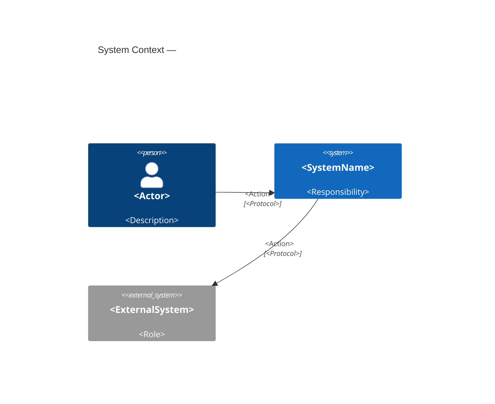

# System Context — <SystemName>

> C4 Level 1 | Audience: stakeholders, architects, PMs

## Purpose
<!-- What problem does this system solve? One paragraph, no implementation detail. -->

## System Boundary
<!-- What is inside the system vs outside. -->

## Users & Actors
| Actor | Type | Interaction |
|-------|------|-------------|
| <name> | Human / External System | <what they do with the system> |

## External Dependencies
| System | Direction | Protocol | Notes |
|--------|-----------|----------|-------|
| <name> | in / out / bidirectional | REST / gRPC / event / ... | |

## Diagram

## Key Constraints & Non-Goals
- <!-- what this system explicitly does NOT do -->

## Open Questions
- [ ] <question> → route to $architect / $adr

---
Maintainer/Author: <MAINTAINER_AUTHOR>
Version: <SEM_VERSION (start at 0.1.0)>
ADR: <link or n/a>
Status: DRAFT / APPROVED
Last modified: <DATE>
---
