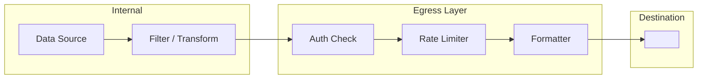

# Egress — <DestinationName>

> Flow Type: Egression | Audience: architects, developers, consumers

## Purpose
<!-- Define how data leaves the system.
     Answers: "where to, in what form, with what guarantee?" -->

## Destination
| Destination | Type | Protocol | Auth | Format |
|-------------|------|----------|------|--------|
| <name> | external system / internal / user | HTTP / WebSocket / file / stream / ... | API Key / OAuth / mTLS / none | JSON / CSV / binary / ... |

## Data Selection
<!-- What data is exposed, filtering, aggregation. -->

## Transformation
| Step | Operation | Output |
|------|-----------|--------|
| 1 | <operation> | <output> |
| 2 | <operation> | <output> |

## Diagram

## Contract
| Field | Type | Always Present | Notes |
|-------|------|-----------------|-------|
| <field> | <type> | yes / no | |

## Rate Limits
| Endpoint | Limit | Burst | Retry After |
|----------|-------|-------|--------------|
| <endpoint> | <limit>/s | <burst> | <duration> |

## Error Handling
| Scenario | Behavior | Notes |
|----------|----------|-------|
| Destination unavailable | retry / buffer / drop | |
| Auth failure | reject | |
| Rate limit exceeded | 429 response | |

## Handoff Guarantees
- At-least-once / At-most-once / Exactly-once
- <guarantee>

## Sensitive Data Notes
<!-- Sensitive data in output, masking, etc. -->

## Open Questions
- [ ] <question> → route to $architect / $adr

---
Maintainer/Author: <MAINTAINER_AUTHOR>
Version: <SEM_VERSION (start at 0.1.0)>
ADR: <link or n/a>
Status: DRAFT / APPROVED
Last modified: 2026-04-13