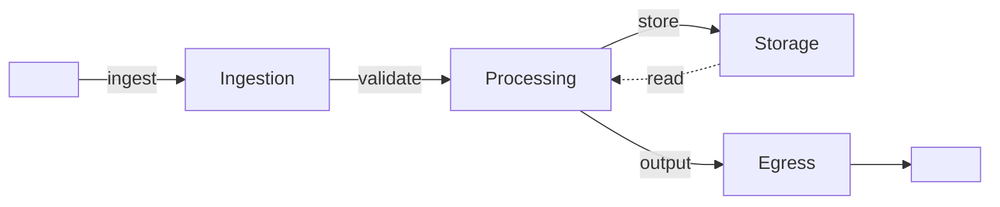

# Data Flow — <FlowName>

> Flow Type: Complete Flow | Audience: architects, data engineers, developers

## Purpose
<!-- Describe a complete end-to-end data flow.
     Answers: "where does the data come from, what happens to it, where does it end?" -->

## Overview
| Aspect | Value |
|--------|-------|
| Start | <source> |
| End | <destination> |
| Frequency | real-time / batch / scheduled |
| Volume | <volume>/<period> |
| SLA | <sla> |

## Lifecycle Steps

### 1. Ingestion
<!-- How data is ingested. Reference ingestion.md if applicable. -->
- Source: <source>
- Protocol: <protocol>
- Format: <format>

### 2. Processing
<!-- How data is transformed. Reference processing.md if applicable. -->
- Transformations: <list>
- Quality checks: <list>

### 3. Persistence
<!-- How data is stored (if applicable). Reference persistence.md if applicable. -->
- Store: <store>
- Retention: <retention>

### 4. Egression
<!-- How data leaves the system (if applicable). Reference egress.md if applicable. -->
- Destination: <destination>
- Protocol: <protocol>

## Diagram

## Sensitive Transitions
| Step | Data Type | Risk | Mitigation |
|------|-----------|------|------------|
| <step> | <type> | <risk> | <mitigation> |

## Error Scenarios
| Scenario | Behavior | Recovery |
|----------|----------|----------|
| <scenario> | <behavior> | <recovery> |

## Monitoring
| Metric | Target | Alert Threshold |
|--------|--------|-----------------|
| <metric> | <target> | <threshold> |

## Open Questions
- [ ] <question> → route to $architect / $adr

---
Maintainer/Author: <MAINTAINER_AUTHOR>
Version: <SEM_VERSION (start at 0.1.0)>
ADR: <link or n/a>
Status: DRAFT / APPROVED
Last modified: 2026-04-13