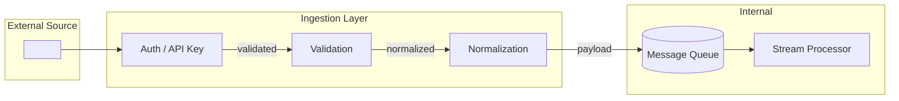

# Ingestion — <SourceName>

> Flow Type: Ingestion | Audience: architects, data engineers, developers

## Purpose
<!-- Define how data enters the system.
     Answers: "what source, what format, what initial validation?" -->

## Source
| Source | Type | Protocol | Auth | Format |
|--------|------|----------|------|--------|
| <name> | external / internal | HTTP / WebSocket / file / stream / ... | API Key / OAuth / mTLS / none | JSON / CSV / binary / ... |

## Initial Validation
<!-- What validations are applied at ingestion? Schema check, size limits, etc. -->

## Schema
| Field | Type | Required | Validation | Notes |
|-------|------|----------|------------|-------|
| <field> | <type> | yes / no | <rule> | |

## Diagram

## Error Handling
| Scenario | Behavior | Retry Policy |
|----------|----------|--------------|
| Invalid format | reject / quarantine | no retry |
| Auth failure | reject | no retry |
| Size exceeded | reject | no retry |
| Timeout | partial / drop | 3 retries with exponential backoff |

## Sensitive Data Notes
<!-- PII, secrets, or sensitive data ingested. Required markers. -->

## Open Questions
- [ ] <question> → route to $architect / $adr

---
Maintainer/Author: <MAINTAINER_AUTHOR>
Version: <SEM_VERSION (start at 0.1.0)>
ADR: <link or n/a>
Status: DRAFT / APPROVED
Last modified: 2026-04-13