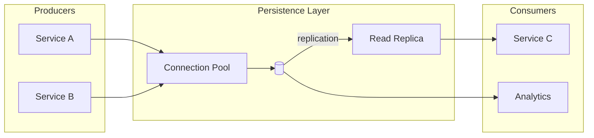

# Persistence — <StorageName>

> Flow Type: Persistence | Audience: architects, data engineers, ops

## Purpose
<!-- Define how data is stored and preserved.
     Answers: "where, how, how long, with what protection?" -->

## Storage Target
| Store | Type | Technology | Location |
|-------|------|-------------|----------|
| <name> | relational / document / time-series / blob / ... | <tech> | <region/cloud/on-prem> |

## Schema
| Table/Collection | Primary Key | Indexes | Partition Strategy |
|-----------------|-------------|---------|---------------------|
| <name> | <keys> | <indexes> | <strategy> |

## Access Patterns
| Operation | Frequency | Volume | SLA |
|------------|-----------|--------|-----|
| write | <freq> | <vol> | <sla> |
| read | <freq> | <vol> | <sla> |
| query | <freq> | <vol> | <sla> |

## Diagram

## Data Protection
| Mechanism | Applied | Details |
|-----------|---------|---------|
| Encryption at rest | yes / no | 
 |
| Encryption in transit | yes / no | 
 |
| Backup | yes / no | <schedule> |
| Retention | <days> | <policy> |

## Retention Policy
| Data Class | Retention | Deletion Method |
|------------|-----------|-----------------|
| <class> | <duration> | soft-delete / hard-delete / archive |

## Compliance
<!-- GDPR, SOC2, HIPAA — storage constraints. -->

## Open Questions
- [ ] <question> → route to $architect / $adr

---
Maintainer/Author: <MAINTAINER_AUTHOR>
Version: <SEM_VERSION (start at 0.1.0)>
ADR: <link or n/a>
Status: DRAFT / APPROVED
Last modified: 2026-04-13