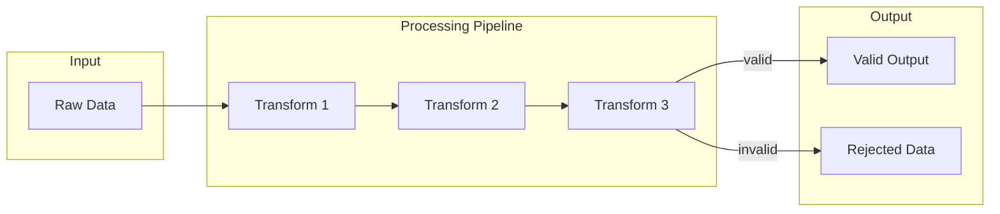

# Processing — <ProcessName>

> Flow Type: Processing | Audience: architects, data engineers, developers

## Purpose
<!-- Define how data is transformed.
     Answers: "what transformation, on what data, with what guarantees?" -->

## Input
| Source | Format | Frequency | Volume |
|--------|--------|-----------|--------|
| <source> | <format> | real-time / batch / scheduled | <volume> |

## Transformations
| Step | Type | Logic | Output | Notes |
|------|------|-------|--------|-------|
| 1 | enrich | <description> | <output> | |
| 2 | validate | <description> | <output> | |
| 3 | aggregate | <description> | <output> | |

## Business Rules
<!-- Business rules applied during processing. -->

## Diagram

## Data Quality
| Metric | Target | Monitoring |
|--------|--------|-------------|
| <metric> | <target> | <how monitored> |

## Error Handling
| Scenario | Behavior | Dead Letter Queue |
|----------|----------|-------------------|
| Transformation failure | skip / fallback / halt | yes / no |
| Data quality violation | quarantine | yes |
| Timeout | partial / retry | yes |

## Irreversible Transformations
<!-- Transformations that permanently destroy information. -->

## Sensitive Data Notes
<!-- Sensitive data transformation, masking, encryption, etc. -->

## Open Questions
- [ ] <question> → route to $architect / $adr

---
Maintainer/Author: <MAINTAINER_AUTHOR>
Version: <SEM_VERSION (start at 0.1.0)>
ADR: <link or n/a>
Status: DRAFT / APPROVED
Last modified: 2026-04-13